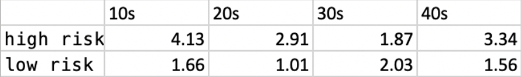
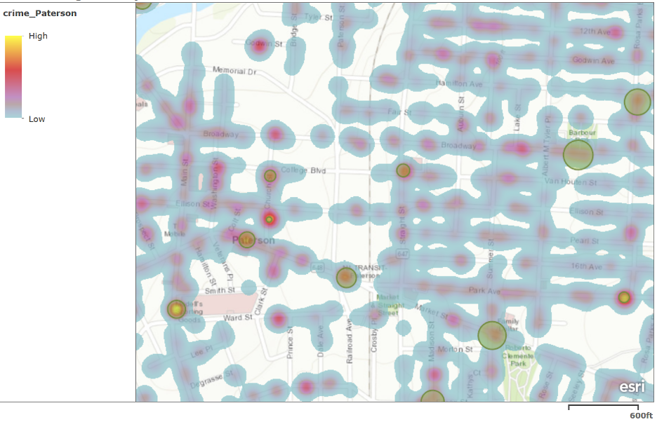
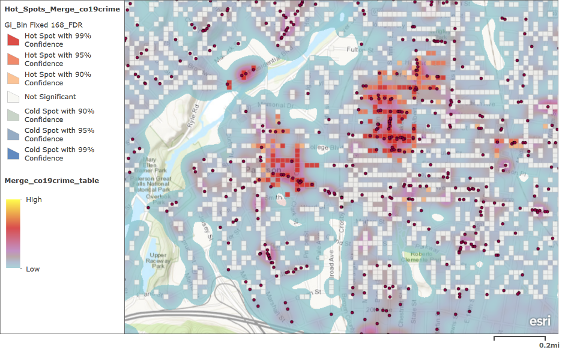
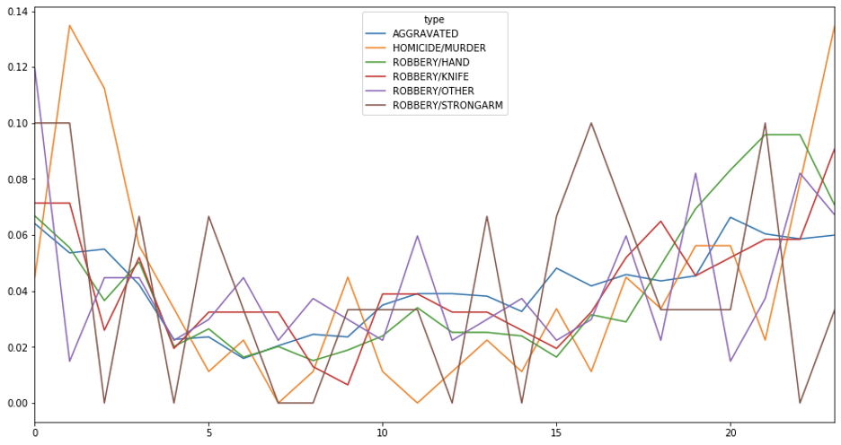
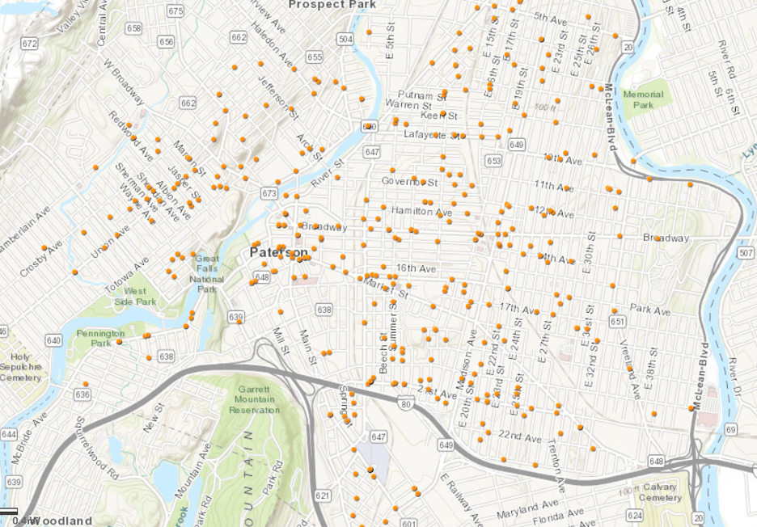
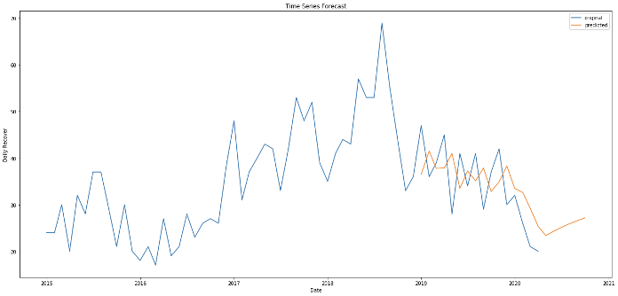

# Crowdsourced Security Cameras Enabling a Real-time Scaled Response to Crime
## Abstract
City of Paterson plans to utilize crowdsourced security cameras to reduce the crime rate by getting a real-time response to the crime and recognize the social distancing violation in this COVID-19 situation. By analyzing geospatial data, the team plotted the overlapped heatmap of both crime and COVID-19 response and found the best places to install cameras. The further clustering of temporal and spatial patterns of crime helped the city to better monitor violent crimes at midnight and theft in the early morning, while the time prediction for each census tract provided the police key regulatory direction in the future.  After the installation of cameras, the team developed a dashboard of public surveillance cameras for social distance detection by using YOLO4, the object detection algorithm. 

## Introduction
City Paterson is going to solve the crime problems by using Crowdsourced Security Cameras and collaborative policing. The city has always been handling the relatively high crime rate compared with other cities in NJ. In the meanwhile, due to the current COVID-19 situation, another type of violation--social distancing violation surges. Our sponsor wants to properly place and utilize cameras to kill two birds with one stone which means placing the camera appropriately which can both detect crime and social distance violation.
  
The scope of the program switched from Crowdsourced Security Cameras to collaborative policing using data and models which is advocated by our sponsor. So, our study focuses on: 1.find out where to install those cameras by overlapping  the city crime and COVID-19 response call data 2. allocate the police force temporally and spatially based on data analytics and modeling 3. develop a Yolo-based model to detect social distancing and blank frame (no person in the frame)

## Results
### Social distancing analyzer
The social distancing analyzer output a real-time system with video and different color boxes. Green color means safe, orange means low risk, and red means high risk. The below has total, safe, low-risk and high-risk counts respectively. Users can monitor real-time change and give quick decisions based on the count. And after analyzing the whole footage, the analyzer will print the average count of risk people on different levels in a fixed period of time. In the result output, the team set the period as 10 seconds. In a real-world scenario, the period can be changed to 1 hour or half an hour. Therefore, Paterson can analyze when will there be a peak and propose proper policy to prevent social distance violations. 

#### passenger count by risk level

#### v1.0 output:

### Mapping
Based on the whole crime data heat map, the team can recognize 22 areas where crime happens frequently( more than 20 cases from 2015 to 2020). For those 22 areas, incidents happen 609 times, which represents 5.10% of all cases from  2015 to 2020.

#### high crime density areas in paterson

As shown in following figure, those areas that are located in high confidence areas and high density areas should be the best location for Surveillance. 
#### overlapped heatmap for Crime and COVID-19

### Clustering
The team filtered the label 0 crime types and found that violent and serious crimes mostly happen at night. It is reasonable as homicide and robbery with weapons shouldn’t be conspicuous so the criminals prefer to take actions after 10 pm. The violent crime rate has always been high in Paterson which should be the top priority to solve. By mapping the location from 10 pm to 2 am, the team found that most of the incidents happen along the streets, especially highways. Installing cameras in the highway might be the most cost-effective way for Paterson as it can seize the movement without obstacles and most incidents occur there. The team decided to collaborate with the Paterson Police Department to reallocate the workforce for monitoring video surveillance in these streets. For example, more people should be assigned around 11 pm-2 am for footage viewing.
#### Distribution of violent crime

#### Map of violent crime between 22 pm -2 am

### Time series analysis
The result shows that tract 1832 has the most incidents number in the previous 5 years. So the team wants to forecast this area first. The figure below is the original and predicted timeline which has little error. Each month, there will be about 25 incidents and the number will slightly increase after May 2020. The team also predicts other tracts and selects the top 5 as the high-risk areas for the police to pay attention to. They are tract 1832, 1829, 1810,1803 and 1813 respectively.
#### Incidents number prediction for the following months

## Features:
* Get the areal time nalytics such as:
   - Number of people in a particular area
   - Number of people in high risk
   - The extent of risk to a particular person.
* Doesn't collect any data of a particular person
* Stores a video output for review

## Installation:
* Fork the repository and download the code.
* Download the following files and place it in the same directory
   - https://github.com/pjreddie/darknet/blob/master/cfg/yolov3.cfg
   - https://pjreddie.com/media/files/yolov3.weights
* For slower CPUs, use yolov3-tiny (link in the code comments)
* Install all the dependenices
* Run social_distance_detection.py
### Credits:
##### We want to appreciate the great help from Ankush Chaudhari who taught the team a lot in terms of yolo and distance calculation
